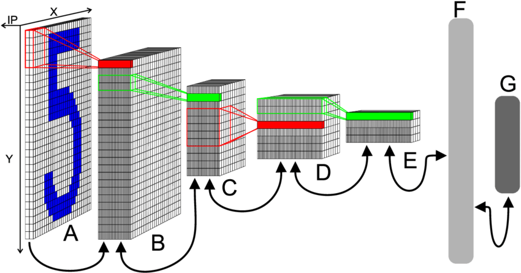

# MNIST Digit Classification using CNN with Streamlit

<p align="center">
    
</p>


This project implements a Convolutional Neural Network (CNN) to classify handwritten digits from the MNIST dataset. The trained model is deployed as a web application using Streamlit, allowing users to interactively upload images of handwritten digits and receive real-time predictions.

## Project Overview

The MNIST dataset is a widely used benchmark in the field of machine learning, containing 60,000 training images and 10,000 test images of handwritten digits (0-9). This project demonstrates the following key components:

- **Data Preprocessing**: Efficient loading and normalization of the MNIST dataset, along with data augmentation techniques to improve the model's generalization ability.
- **Model Architecture**: Construction of a CNN model incorporating convolutional layers, pooling layers, dropout for regularization, and batch normalization to enhance performance.
- **Training and Evaluation**: Training the CNN on the MNIST dataset, evaluating its performance on unseen data, and achieving high accuracy.


## 🌟 Key Features
- Real-time digit classification
- Multiple input methods:
  - Sample image selection
  - Image upload
  - Webcam capture
- Confidence score visualization
- Interactive user interface
- Pre-processed sample images with both black and white backgrounds

## 🛠️ Technologies Used
- Python 3.8+
- TensorFlow 2.x
- Streamlit
- Pillow (PIL)
- NumPy
- MNIST Dataset

## 📁 Project Structure
```
mnist-classifier/
├── app.py                 # Main Streamlit application
├── generate_samples.py    # Script to generate sample images
├── requirements.txt       # Project dependencies
├── model/
│   └── best_model_v2.keras  # Trained MNIST model
├── samples/              # Sample digit images
│   ├── digit_0_sample_1.png
│   ├── digit_0_sample_2.png
│   └── ...
└── README.md            # Project documentation
```

## 🚀 Getting Started

1. Clone the repository:
```bash
git clone https://github.com/your-username/mnist-classifier.git
cd mnist-classifier
```

2. Install dependencies:
```bash
pip install -r requirements.txt
```

3. Generate sample images:
```bash
python generate_samples.py
```

4. Run the application:
```bash
streamlit run app.py
```


---


## 🎯 Future Improvements
1. fine-tune to mobile camera dataset
2. Add support for multiple digit recognition
3. Implement batch processing capability
4. Add export functionality for predictions
5. Enhance UI with additional visualizations
6. Add model performance metrics display

## 📊 Model Performance
- Test Accuracy: 99.3%

## 💡 Key Learnings
- Deploying machine learning models in a web application
- Building interactive UIs with Streamlit
- Image processing and preprocessing techniques
- Session state management in web applications
- Error handling and user experience design

## 🔗 Links
- [Live Demo](https://digit-recognizer-app-er4ydd5ahxeqd8mbgp9esz.streamlit.app/)
- [GitHub Repository](https://github.com/sayedgamal99/Digit-Recognizer-APP)
- [LinkedIn Profile](https://www.linkedin.com/in/sayed-gamal-028103217)

## 📄 License
MIT License - feel free to use this project for learning and development.
